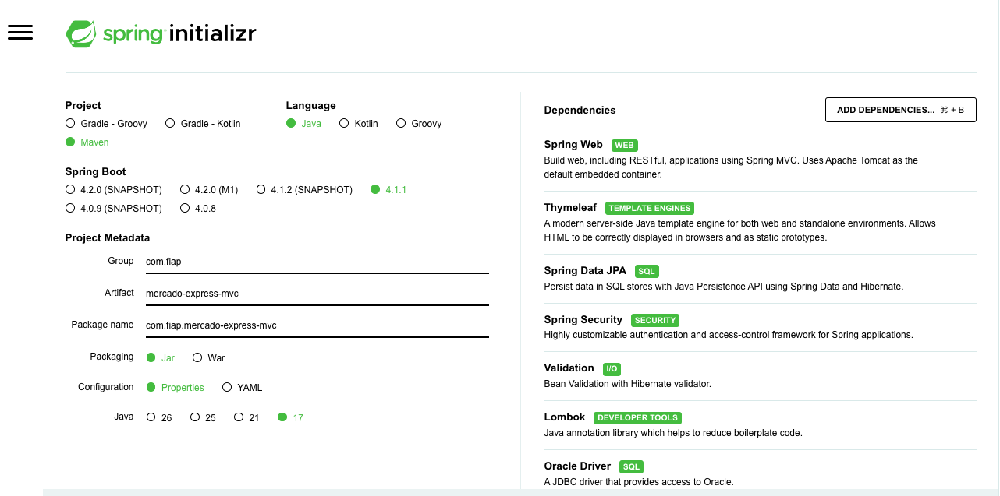
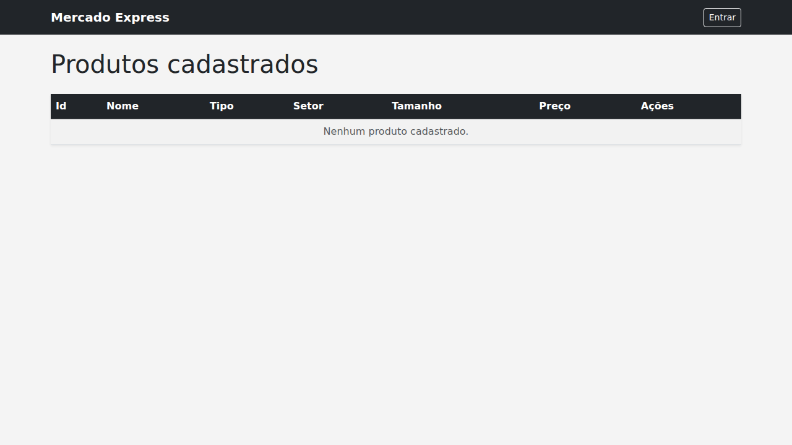
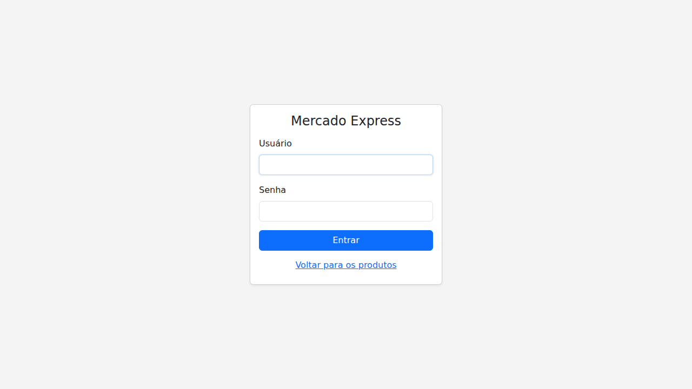
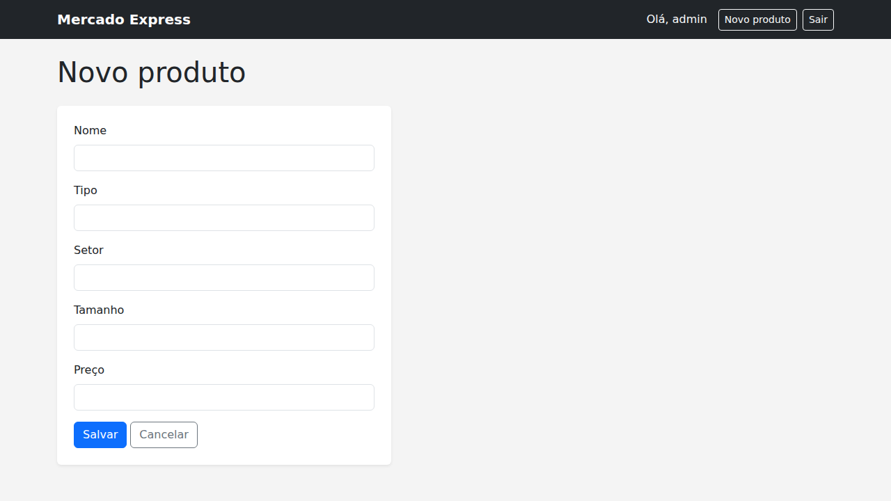
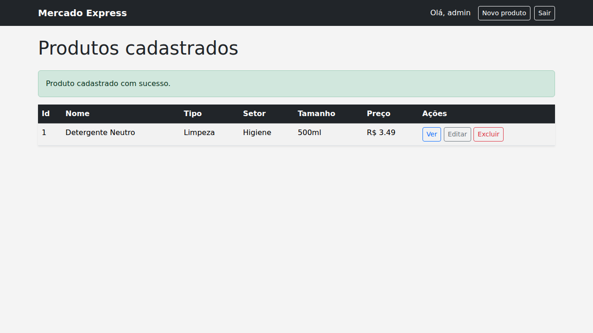
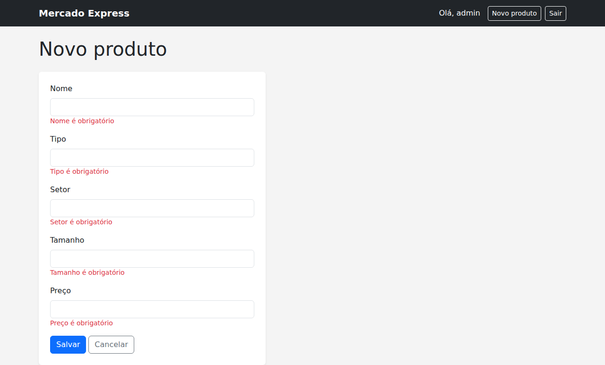
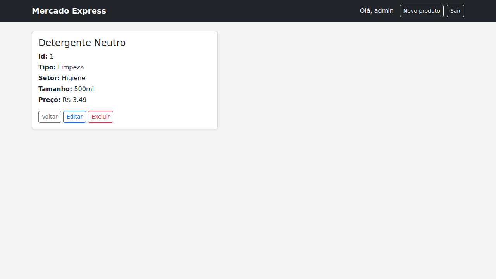
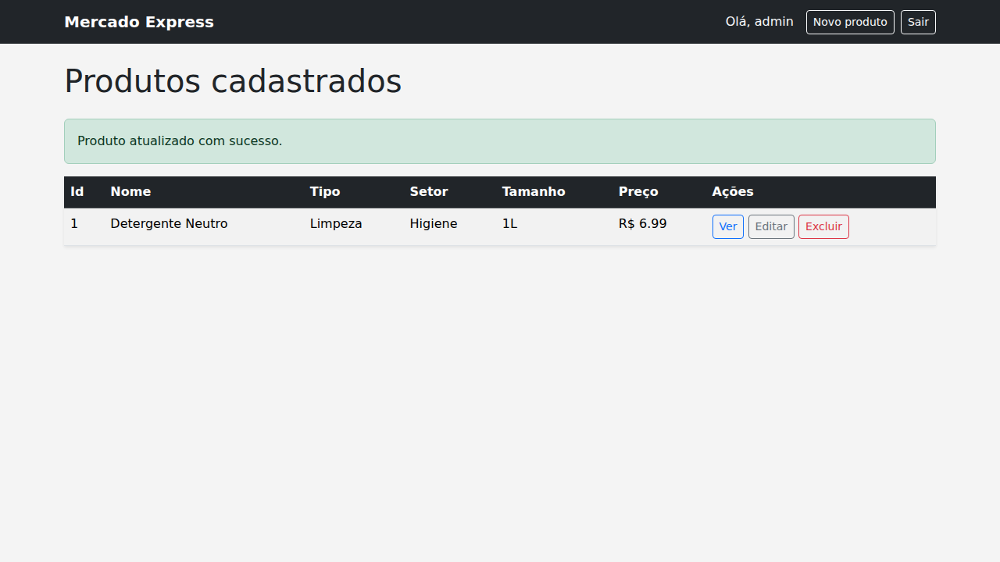
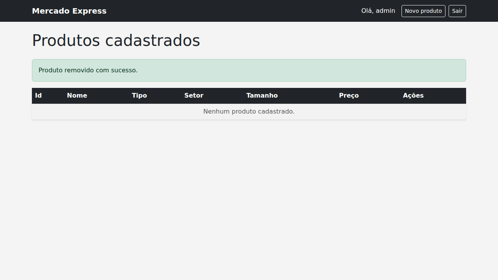

# Mercado Express - MVC

Trabalho de Checkpoint 4 (Parte 2 - MVC, Security e Deploy) da disciplina de TDS, FIAP, sob orientação do professor Dr. Marcel Stefan Wagner.

Este repositório é a continuação do projeto entregue na Parte 1 ([mercado-express-cp4](https://github.com/lopesadvisory/mercado-express-cp4), a API REST com HATEOAS). Aqui o mesmo domínio - controle de estoque de um mercado express - ganha uma interface Web construída com Spring MVC e Thymeleaf, com o CRUD completo (Create, Read, Update e Delete) navegável por links e botões, e com Spring Security controlando o que é público e o que exige login.

A aplicação está publicada e em funcionamento em: **[a preencher após o deploy no Render]**

## Integrantes

- Nicolas Monteiro Ramiro - RM 562380
- Marcus Vinicius Vila Nova da Silva - RM 558771
- Hebert Lopes dos Santos - RM 563192

IDE utilizada no desenvolvimento: **IntelliJ IDEA**.

## Tecnologias utilizadas

- Java 17
- Spring Boot 3.3.4, com os módulos Web, Thymeleaf, Data JPA, Security e Validation
- Maven
- Lombok, usado na entidade `Produto` para eliminar getters, setters e construtores escritos manualmente
- Oracle Database (SQL Developer / ORACLE_FIAP), acessado via Spring Data JPA - o mesmo banco utilizado na Parte 1
- Spring Security, com autenticação em memória e definição de rotas públicas e privadas
- Bootstrap 5, para o layout das telas
- Docker e Render, para o deploy

Configuração final gerada no Spring Initializr:

## Estrutura de dados

Os produtos são armazenados na tabela `TDS_MVC_TB_MERCADO`, criada no Oracle com as colunas:

| Coluna  | Tipo          | Descrição                                   |
|---------|---------------|----------------------------------------------|
| ID      | NUMBER        | Identificador do produto, gerado automaticamente |
| NOME    | VARCHAR2(100) | Nome do produto                             |
| TIPO    | VARCHAR2(50)  | Categoria do produto (ex: Limpeza)          |
| SETOR   | VARCHAR2(50)  | Setor do mercado onde o produto fica (ex: Higiene) |
| TAMANHO | VARCHAR2(20)  | Tamanho ou embalagem do produto (ex: 500ml) |
| PRECO   | NUMBER(10,2)  | Preço unitário do produto                   |

A tabela e a sequence do ID (`TDS_MVC_SEQ_MERCADO`) são criadas automaticamente pelo Hibernate na primeira execução da aplicação.

## Telas e rotas

Base: `/produtos`

| Rota                        | Método | Ação                                  | Acesso     |
|------------------------------|--------|----------------------------------------|------------|
| `/produtos`                  | GET    | Lista os produtos cadastrados          | Público    |
| `/produtos/{id}`             | GET    | Exibe o detalhe de um produto          | Público    |
| `/produtos/novo`             | GET    | Formulário de cadastro                 | Autenticado |
| `/produtos`                  | POST   | Cadastra um novo produto               | Autenticado |
| `/produtos/{id}/editar`      | GET    | Formulário de edição, já preenchido    | Autenticado |
| `/produtos/{id}/editar`      | POST   | Atualiza o produto                     | Autenticado |
| `/produtos/{id}/excluir`     | POST   | Remove o produto                       | Autenticado |
| `/login`                     | GET    | Tela de login                          | Público    |

Qualquer visitante consegue consultar a lista de produtos e o detalhe de cada um, sem se autenticar. Cadastrar, editar ou excluir um produto exige login - ao tentar acessar essas rotas sem estar autenticado, o Spring Security redireciona automaticamente para a tela de login e, após o login bem-sucedido, retorna para a página que havia sido solicitada.

### Listagem de produtos (rota pública, sem login)

### Tela de login

Ao tentar cadastrar, editar ou excluir sem estar autenticado, a aplicação redireciona para esta tela:

### Cadastro de um novo produto (CREATE)

Formulário de cadastro, disponível apenas para usuários autenticados:

Após salvar, o produto aparece na listagem com a mensagem de sucesso:

### Validação do formulário

Campos obrigatórios não preenchidos são sinalizados no próprio formulário, sem submeter dados inválidos:

### Detalhe do produto (READ)

Ao clicar em "Ver" na listagem, os dados completos do produto são exibidos. Os botões de editar e excluir só aparecem para quem está autenticado:

### Atualização de um produto (UPDATE)

Formulário de edição pré-preenchido; após salvar, a listagem é atualizada com a mensagem de sucesso:

### Remoção de um produto (DELETE)

Após confirmar a exclusão, o produto sai da listagem:

## Segurança (Spring Security)

A aplicação usa Spring Security com um usuário administrador configurado em memória (`InMemoryUserDetailsManager`, com a senha protegida por BCrypt). As regras de autorização são definidas em `SecurityConfig`:

- **Rotas públicas:** página inicial, listagem de produtos (`GET /produtos`), detalhe de um produto (`GET /produtos/{id}`) e a tela de login.
- **Rotas privadas (exigem autenticação):** cadastro (`GET`/`POST /produtos/novo` e `POST /produtos`), edição (`GET`/`POST /produtos/{id}/editar`) e exclusão (`POST /produtos/{id}/excluir`).

As credenciais do usuário administrador são lidas de variáveis de ambiente (`ADMIN_USER` e `ADMIN_PASSWORD`), com um valor padrão apenas para uso em desenvolvimento local.

## Deploy

A aplicação está publicada no Render, com build automatizado a partir do `Dockerfile` e do `render.yaml` presentes no repositório, reaproveitando o mesmo banco Oracle FIAP da Parte 1.

- Aplicação publicada: **[a preencher após o deploy no Render]**
- Repositório GitHub: https://github.com/lopesadvisory/mercado-express-cp4-mvc

## Executando o projeto localmente

Para rodar a aplicação fora do Render (por exemplo, no IntelliJ), é necessário configurar as seguintes variáveis de ambiente antes de iniciar a classe `MercadoExpressMvcApplication`:

- `DB_USER` - usuário do Oracle FIAP (RM)
- `DB_PASSWORD` - senha do Oracle FIAP
- `ADMIN_USER` - usuário administrador da aplicação (opcional, padrão `admin`)
- `ADMIN_PASSWORD` - senha do usuário administrador (opcional, padrão `admin123`)

Nenhuma credencial fica salva no código ou no repositório - elas são lidas em tempo de execução a partir dessas variáveis. Com elas configuradas, a aplicação sobe em `http://localhost:8082`.

## Vídeo de demonstração

**[a preencher com o link do vídeo mostrando a interface Web em funcionamento]**
